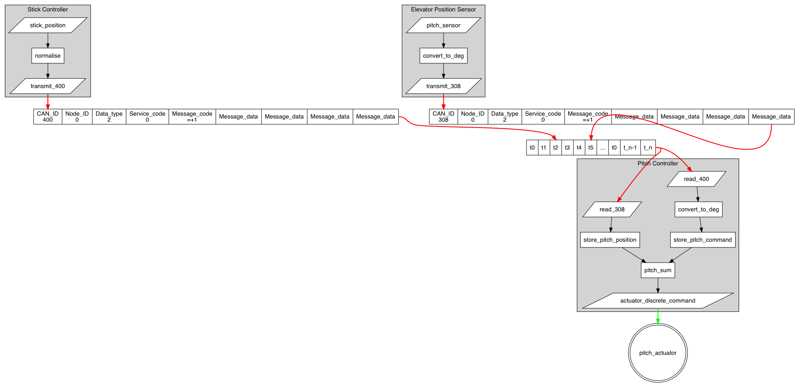

# openFCS

## Introduction

The idea behind this repo is to create a record of the development of an open source, fly-by-wire, flight control system (FCS).  The end goal is to have a functioning prototype that could be tested against a back-up conventional flight control system on a special certificate, experimental aircraft.

## Concept

Use Commercial Off The Shelf components (COTS) to create a modular, expandable, and flexible flight control system.

Although the name suggests this is a FCS project, there is no reason the concept couldn't be expanded to cover all aspects of air vehicle management.

## Initial thoughts

### Protocol and Hardware

My initial idea would be use a CANaerospace methodology as it is low-cost, reliable, and (for the CAN element) prolific in today's automotive industry.  Hardware could be ardino with a CANbus shield control modules driven by a USB flight controller or custom stick and rudder.  Surfaces would be driven from COTS actuators.

## Pre-reading

### Research

- http://henrysbench.capnfatz.com/henrys-bench/arduino-projects-tips-and-more/arduino-can-bus-module-1st-network-tutorial/
- https://www.researchgate.net/publication/269784823_Reliable_and_Cost-Effective_Flight_Testing_of_Ultralight_Aircraft

### Protocol

- https://en.wikipedia.org/wiki/CANaerospace
- https://www.stockflightsystems.com/index.php?option=com_docman&task=doc_download&gid=16&Itemid=45

### Hardware

- https://www.sparkfun.com/products/13262

## Prototyping Parts

| Part no    | Description                  | Qty      | Source    |
| ---------- | ---------------------------- | -------- | --------- |
| 202425-US1 | Stepper Motor and Controller | 1        | Amazon    |
| 224GW/C-R  | Twisted Pair, 24 AWG         | 1        | Amazon    |
| B01IV3ZSKO | CAN Bus Module               | 3        | Amazon    |
| EL-CB-001  | UNO R3 Board                 | 2        | Amazon    |
| EL-CB-001  | UNO R3 Starter Kit           | 1        | Amazon    |
